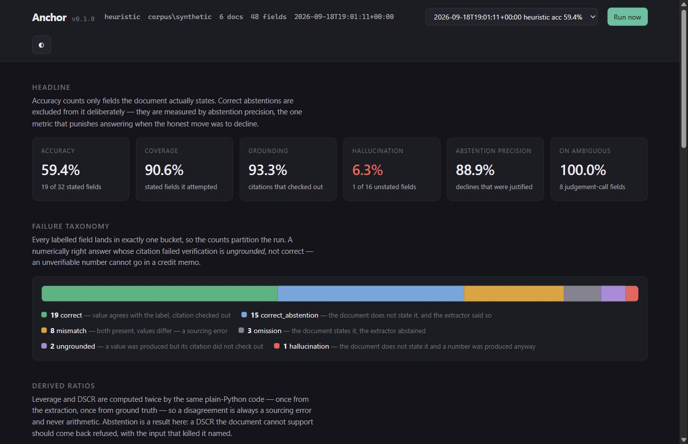
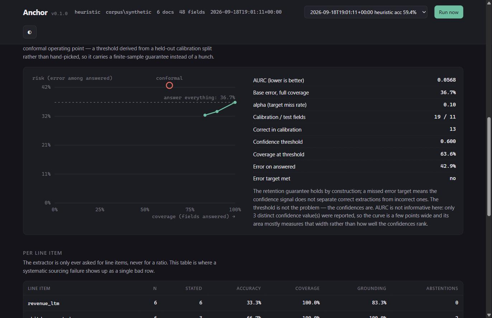
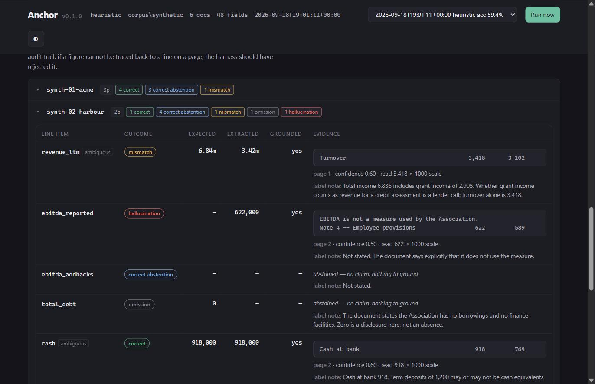

# Anchor

An evaluation harness for evidence-anchored credit-metric extraction.

Anchor scores an extractor on three questions a credit fund has to answer before
it can use one:

1. **Did it get the number right?**
2. **Can the number be traced to a line on a page?**
3. **Did it know when not to answer?**

Most extraction benchmarks skip the third, and it decides whether a pipeline is
usable. A set of statutory accounts often does not disclose scheduled principal
repayments, so DSCR is not computable from the document at all. The correct
behaviour is to say so. A confident wrong DSCR costs more than a flagged one, and
only the third question tells them apart.



> **Read this before the numbers.** The real corpus is not populated yet.
> `corpus/golden/` is empty. Every figure below comes from six invented
> documents in `corpus/synthetic/`, and none of them is a benchmark result. The
> LLM extractor is built and tested but **has never been run against a model**,
> so the head-to-head table is empty. Both gaps are marked where they appear.

## The design decision everything else follows from

**The extractor is only ever asked for line items. Never for a ratio.**

Leverage and DSCR are computed in `anchor/ratios.py` by plain Python. That makes
the arithmetic correct by construction, and leaves every remaining error as a
*sourcing* error you can attribute to one line item. A wrong leverage multiple is
never ambiguous between "it misread the debt row" and "it divided badly".

Two more decisions come from the same instinct.

**Grounding beats correctness.** A numerically correct answer whose citation
fails verification scores `UNGROUNDED`, not `CORRECT`. You cannot put an
unverifiable number in an investment committee memo, so for scoring purposes it
is not an answer. Ranking it as a success would let a model that fabricates
citations post the same headline as one that reads the document.

**An undefined rate reports as undefined.** Every rate returns `None` when its
denominator is zero, never `0.0`. "We never asked" and "we asked and it always
failed" are different facts. The regression gate treats a metric that stopped
being measurable as a breach, not a pass.

## Install

```bash
pip install -e ".[dev]"
```

Python 3.11+, four runtime dependencies. The baseline extractor, the CLI and the
web interface all run with no API key and no network.

## Use

```bash
anchor corpus --corpus corpus/synthetic    # what is labelled, and can it be scored
anchor run    --corpus corpus/synthetic    # score an extractor, write the artifact
anchor gate   --corpus corpus/synthetic    # the same run, graded against committed floors
anchor sweep  --corpus corpus/synthetic    # score several models, print the frontier
anchor serve  --corpus corpus/synthetic    # browse it: evidence, ratios, the frontier
anchor extract corpus/synthetic/text/synth-01-acme.json   # one document
```

Exit codes are the contract with CI. `0` means success. `1` means a gate breach:
the run worked, the numbers are not good enough. `2` means a usage or data error,
where the run never happened. Collapse the last two and a wrong `--corpus` path
reads as a quality regression at three in the morning.

### What a run reports

```
overall         accuracy   59.4%  coverage   90.6%  grounded   93.3%  halluc    6.2%  abst.prec   88.9%
on ambiguous    accuracy   20.0%  coverage   80.0%  grounded   75.0%  halluc    0.0%  abst.prec  100.0%

outcome                 n   share
correct                19   39.6%
mismatch                8   16.7%
omission                3    6.2%
hallucination           1    2.1%
correct_abstention     15   31.2%
ungrounded              2    4.2%
```

Six mutually exclusive outcomes, so the counts partition the run. Two of them are
not failures. `correct_abstention` is a win, and it stays out of the accuracy
denominator so it can neither help nor hurt that figure. Abstention quality gets
its own metric, `abstention_precision`, the only one that costs an extractor
something for answering when the honest move was to decline.

The second row restricts every figure to fields whose labelling took a judgement
call. That subset is the abstention test set, and a calibrated extractor should
look better there than it does overall.

## The web interface

```bash
anchor serve --corpus corpus/synthetic
```

Serves on `127.0.0.1:8756`. Standard library only, one page, no external
requests.

The terminal gives you rates. It cannot give you what makes them trustworthy: the
quote the extractor read, next to the figure it reported, next to what the label
says. `anchor serve` puts those together. Expand any field to see its page, its
quote, its grounding verdict and the labeller's note. Expand any derived ratio to
see the reason it was refused and which input killed it.

Two things the page is built to show, both from the synthetic corpus.

**A grounded hallucination.** The extractor reports EBITDA of 622,000 and cites a
quote that does sit on the page and does contain that number. Page check passes,
quote check passes, value check passes. The document still never states EBITDA:
the label mention and the figure belong to different rows. Grounding is necessary
and not sufficient, and you can watch that happen on screen.

**A refused ratio.** A set of statutory accounts does not disclose scheduled
principal, so the extractor abstains on that field and the ratio layer declines
to produce a DSCR at all, saying which input it was declined for. Assuming the
missing leg is zero would overstate coverage in the direction that flatters the
borrower, and this is the case the whole project is built around.

## Regex versus model

`anchor sweep` scores several configurations over one corpus and prints the
frontier. Accuracy sits next to cost, because neither answers the question on
its own:

```bash
export ANTHROPIC_API_KEY=sk-ant-...
anchor sweep --corpus corpus/synthetic
```

| Extractor | Accuracy | Grounding | Abstention precision | $/doc | p50 latency |
|---|---|---|---|---|---|
| `heuristic` (regex baseline) | 59.4% | 93.3% | 88.9% | $0 | 0.02s |
| `claude-haiku-4-5` | not run | not run | not run | not run | not run |
| `claude-sonnet-5` | not run | not run | not run | not run | not run |
| `claude-opus-5` | not run | not run | not run | not run | not run |

**Those rows say "not run" because the sweep has never run.** It needs an API
key, and this repository has never had one. Filling them in is one command; the
dashes stay until it has been run, because a number nobody measured is worth
less than an obvious gap.

The row that matters is not the most accurate one. It is whichever row is
cheapest at acceptable accuracy, and the sweep marks the frontier so that is
readable directly. A finding like "Haiku reaches 94% of Opus's accuracy at 8%
of the cost" is a procurement decision rather than a benchmark.

## The first real-document result

`anchor import` builds a corpus from an external labelled dataset. The first
adapter reads [Kleister Charity](https://github.com/applicaai/kleister-charity):
2,788 annual reports filed with the Charity Commission for England and Wales,
OCR'd, long, and inconsistently laid out. Exactly the distribution
`corpus/README.md` specifies, already annotated by someone else.

```bash
git clone https://github.com/applicaai/kleister-charity   # labels and OCR text, no PDFs needed
anchor import kleister-charity --from ./kleister-charity --limit 15
anchor run --corpus corpus/kleister-charity
```

On fifteen real charity reports the regex baseline scores **0.0% accuracy**,
against 59.4% on the synthetic corpus:

| | Synthetic (6 docs) | Kleister Charity (15 docs) |
|---|---|---|
| Accuracy | 59.4% | **0.0%** |
| Coverage | 90.6% | 21.4% |
| Omission | 6.2% | 73.3% |
| Grounding | 93.3% | 100.0% |
| Hallucination | 6.2% | 0.0% |

The diagnosis is vocabulary, and the harness produced it directly. UK charity
accounts are written to the SORP, so revenue appears as `incoming resources`
(8 of 15 documents), `total income` (6), `gross income` (4) or `total incoming
resources` (3). The extractor's revenue vocabulary is corporate: `total
revenue`, `turnover`, `sales revenue`. It abstained on eleven documents because
it had never heard of the words they use.

Two things worth taking from that. The synthetic corpus was **flattering the
baseline**, which is what a corpus built to exercise plumbing does and why no
figure from it should be read as a benchmark. And the failure mode is the
honest one: 73% omission with zero hallucinations and 100% grounding. Faced with
vocabulary it did not know, the extractor declined rather than guessed.

Fixing it means adding SORP terms to the label map, and that is a decision
rather than a chore: adding vocabulary because an eval set revealed it is
tuning on the test set. Any such change belongs in a held-out split, which is
why the adapter takes `--split`.

### A manual spot check, which is not a benchmark row

With no API credit available, the six Kleister documents whose labels had not
been seen were read by hand and the claims replayed through the scoring
pipeline by `anchor run --extractor offline --transcripts <dir>`. It answers
one question: are these
figures findable at all, or is the 0.0% telling us the task is impossible?

They are findable. Two of six scored correct against a regex that gets none of
them, and a third was right but uncitable.

**Read this as a sidebar and nothing more.** Six documents, one line item, no
cost or latency, a different prompt from the one `claude.py` sends, and a reader
who had the whole project in context. `anchor sweep` excludes offline runs from
the frontier for that reason, and so should you.

What it exposed is worth more than the score:

- **Bad citations killed three correct answers.** The first pass scored 0.0%,
  below the regex, because quotes like `"Total Income"` name the row without
  containing the figure. `value_in_quote` rejected them. The one claim that
  passed verification was the wrong one.
- **A retyped quote fails as surely as a fabricated one.** Even the full row was
  rejected until it was copied out of the page verbatim; a hand-transcribed OCR
  damage character differed from the document.
- **A composed figure cannot be cited.** One correct value is the sum of four
  rows, and no single row states it, so the evidence model has nowhere to point.
  `total_debt` has the same shape wherever borrowings split across current and
  non-current.
- **Confidence ran backwards.** The highest-confidence claim of the six, 0.85,
  was wrong: a charity reporting in US dollars against a label the annotators
  had converted to GBP. The lowest, 0.25, was right. That inversion is what
  AURC is for, and `claude.py` now tells the model never to convert.

## The regression gate

Extraction pipelines degrade without telling you. A prompt edit or a model
version bump does not announce that recall on `total_debt` just fell by a third.
The gate turns that into a build failure:

```json
{
  "metrics": {
    "accuracy":           {"min": 0.55, "note": "measured 0.594 over 6 documents"},
    "hallucination_rate": {"max": 0.10, "note": "measured 0.062"}
  }
}
```

Each entry carries its own direction, so nobody has to remember whether a bigger
`omission_rate` is better. Each carries a `note` recording where the bound came
from. A floor with no provenance is a number nobody dares move, which is how
gates end up disabled. Moving one costs you a reviewed diff with a reason
attached.

Metric names address the whole report. Bare names read the run overall,
`ambiguous.*` reads the abstention test set, `field.<line_item>.*` reads one line
item, `ratio.safety` reads the derived ratios. A name that does not exist fails
at load time, before anything runs. A typo that gates on nothing is worse than no
gate, because it reports green.

## Abstention, without a hand-picked cutoff

Every confidence-gated pipeline eventually has to answer one question: where does
the threshold go? The usual answer, "0.8 looked good on the dev set", re-breaks
itself whenever the model, the prompt or the document mix changes.

`anchor/conformal.py` implements split conformal abstention
([arXiv:2405.01563](https://arxiv.org/abs/2405.01563)). The threshold comes from
a held-out calibration split and carries a finite-sample, distribution-free
retention guarantee. Anchor takes that split by whole document, because fields
within one document share a units declaration, a layout and a text layer, and are
not exchangeable with each other in the way the guarantee needs.



What the harness reports is weaker than the guarantee, on purpose. The
distribution-free part is retention: you throw away at most an `alpha` fraction
of the answers you should have given. The quantity a credit committee cares
about, error rate among the answers you did give, follows only when the
confidences separate correct from incorrect. So Anchor measures that on a test
split and reports whether it held. On the baseline it does not hold, and the
report says why: three distinct confidence values across the whole run, which
rank almost nothing. No threshold fixes that.

## The corpus

`corpus/` is **specified but not populated**: `corpus/golden/` is empty and no
real filing has been labelled. The specification calls for ASIC
small-proprietary financials, charity and NFP statements, and small council and
co-operative reports, and it avoids SEC EDGAR 10-Ks on purpose, since they are
XBRL-tagged and machine-readable by design and scoring an extractor on them
measures the wrong thing. `corpus/README.md` sets out the labelling protocol and
where to get documents; `corpus/sources.md` is where provenance goes as they
arrive.

Populating it is a browser job rather than a JSON-editing job: drop a PDF into
`corpus/pdfs/`, and `anchor serve` shows it as unlabelled, extracts it, and lets
you record each field against the evidence.



`corpus/synthetic/` holds six invented documents committed as page text, so the
gate runs on any checkout. They are not filings and produce no benchmark number.
Each one plants a specific failure mode that real documents contain, and
`corpus/synthetic/README.md` lists which.

## Layout

| Module | |
|---|---|
| `schema.py` | The data contracts. Line items, evidence, extractions, golden records. |
| `extractors/base.py` | The `Extractor` protocol. Anchor scores anything that satisfies it. |
| `extractors/heuristic.py` | A deterministic keyword-anchored baseline. No key, no network, and a floor the LLM has to clear. |
| `extractors/claude.py` | The LLM extractor. Pydantic-constrained JSON, evidence per field, retry-and-abstain, cost and latency recorded. |
| `verify.py` | Does the quote sit on the cited page, and does the reported number appear inside it? |
| `ratios.py` | Leverage, DSCR, adjusted EBITDA. Each one computes or refuses, naming the input that killed it. |
| `scoring.py` | The six-outcome taxonomy and the aggregate report. |
| `conformal.py` | Split conformal abstention, risk-coverage curve, AURC. |
| `corpus.py` | Loading labels and locating the documents behind them. |
| `runner.py` | The end-to-end run, and the artifact it produces. |
| `gate.py` | Committed floors, and grading a run against them. |
| `render.py` | Terminal output. |
| `web.py` | The local interface. |

## Known limits

- **Both corpora are small.** Six invented documents and fifteen imported ones.
  Confidence intervals are wide, one document moves accuracy by several points,
  and the ordering between two close extractors is not established. Every figure
  reports its N.
- **An imported corpus measures one field.** Kleister annotates charity income
  and nothing else Anchor tracks, so seven of eight line items are omitted from
  its golden records rather than labelled absent. It also ships no page
  separators, so every imported document is one page and grounding figures from
  it are not comparable with paginated ones.
- **The LLM extractor has never been run against a model.** It is built, tested
  against a fake client, and wired into `anchor run` and `anchor sweep`, but no
  row of the head-to-head table has been measured. Until it has, the only
  extractor this repository has evidence about is the regex.
- **One labeller, no adjudication.** A second would surface disagreements a
  single pass cannot, and the disagreement rate would tell you something on its
  own.
- **The corpus skews Australian and NFP**, which is not where most private-credit
  volume sits.
- **AURC currently tells you little.** The baseline reports three confidence
  tiers, so the risk-coverage curve spans a few points and its area mostly
  measures that span. The run says as much instead of printing the number bare.
- **The baseline cannot fabricate a citation**, since it quotes the line it read
  from. Its two ungrounded fields come from misreading a figure out of OCR damage
  and out of a fiscal-year token, which is narrower than a model inventing a
  source.
- **The baseline reads one row per line item.** Where a figure is split across
  rows, such as current plus non-current borrowings, or principal split between a
  loan repayment and a lease repayment, it takes the first and misses the rest.
  That fault currently costs `total_debt` two documents and produces one wrong
  DSCR, and `corpus/synthetic/thresholds.json` keeps a tight floor on
  `ratio.safety` as its tripwire.
